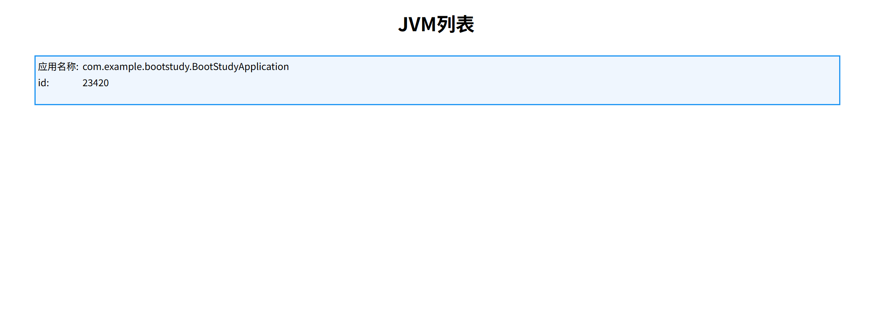
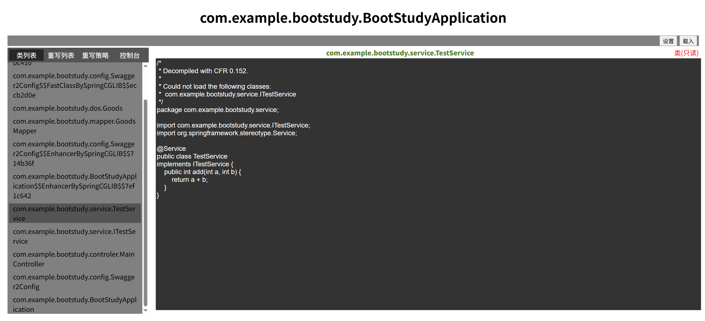
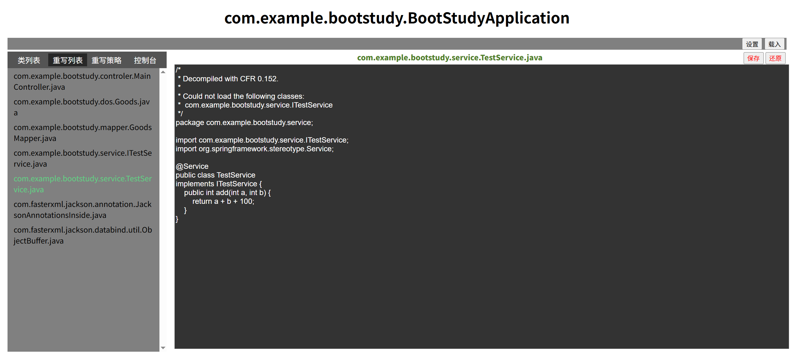
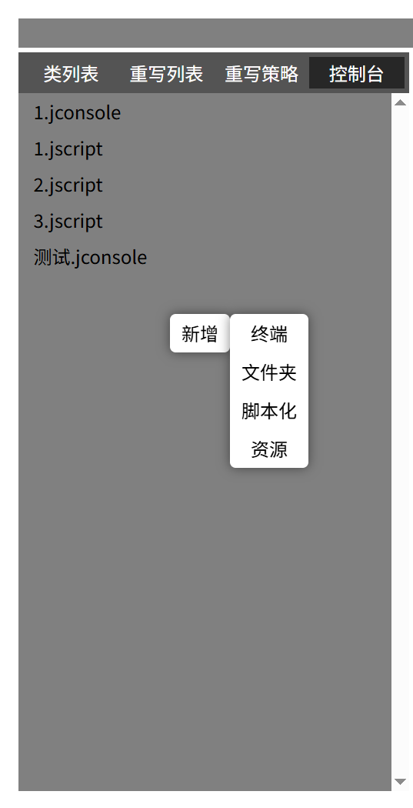
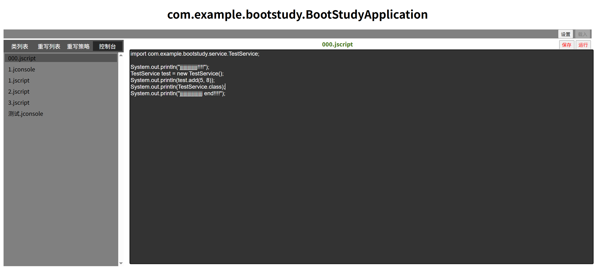
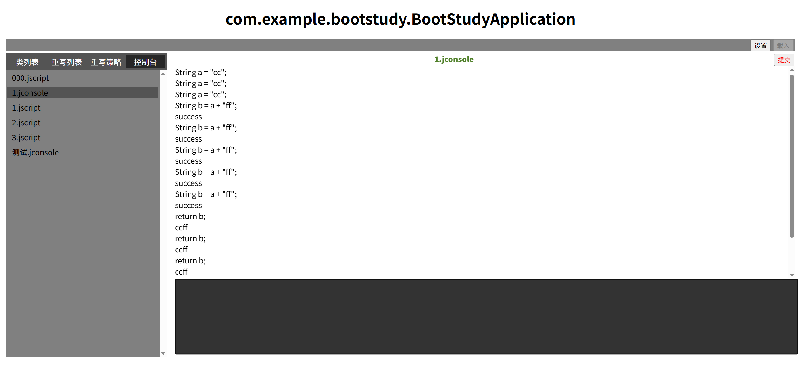

# atom
atom是一个开发小工具
### 可以解决的问题
对于java应用的日常开发中，频繁多次的修改少量代码，每次都要花很久去打包部署，使用它可以无启停的动态更新单个程序类，以达到快速更新代码的目的。

### 核心特性
1. 对于运行中的jvm服务，反编译查看运行中java代码
2. 动态无启停的快速更新运行中的java代码
3. 像执行脚本一样在目标服务中执行指定的java代码，达到某些目的（如清理缓存）
4. 属于java的交互式代码终端

### 使用方式
#### 启动服务
在部署了业务应用的服务器上，运行atom-web-console.jar，
按springboot的方式启动，java -jar atom-web-console.jar
您可以指定服务启动的端口server.port如 java -jar atom-web-console.jar --server.port=80，默认使用8081端口
启动完成后便能访问 http://ip:port/main 查看服务器上运行的所有jvm进程 

#### 反编译查看代码
在首页jvm列表中，点击目标应用
点击载入，即可获取目标应用已加载的类列表，在类列表中点击任意类，获取反编译代码

#### 动态更新类代码
在类列表中，右击对应类，点击编辑重写，便可基于反编译的源码编辑修改，修改完成后保存
点击执行便可发起类动态更新
重写列表中，正在执行重写的类将会高亮展示，可点击还原回退重写

#### 脚本化执行
点击控制台
在左侧列表中右键新增，选择脚本化，输入需要保存的名称

编辑脚本化内容，同java语法，可以设置import导入应用中的类

编辑完成后点击保存，脚本化文件后缀为.jscript

点击运行可执行脚本内容，脚本将在目标应用上执行

#### 交互终端
点击控制台
在左侧列表中右键新增，选择终端，输入需要保存的名称

终端交互文件后缀为.jconsole

使用java语法，同交互式终端一样输入执行，指令将在目标应用上执行

使用return语法展示上下文中的变量

### 待支持
目前不支持的语法
* lambda表达式
* switch语句
* break关键字
* continue关键字
* Unicode字面量
* 类型强转时，使用目标全类名强转
